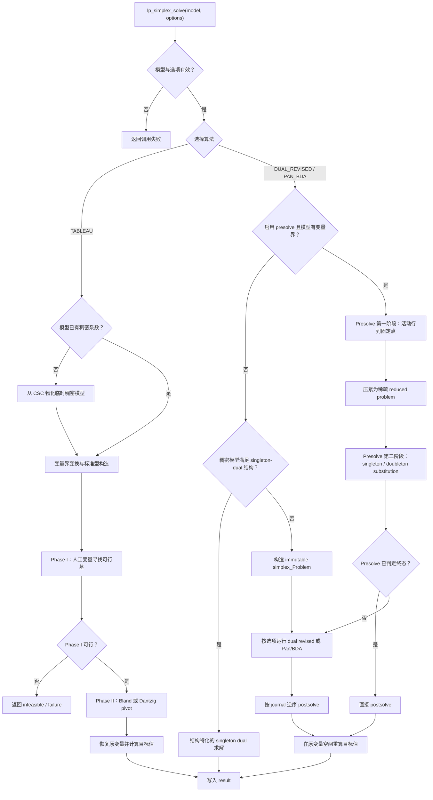
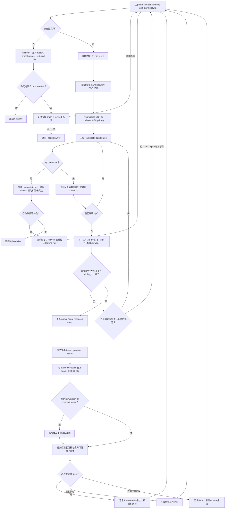

# lp_simplex 整体算法说明

本文以当前代码为准，说明 `lp_simplex` 从公开模型、预处理到求解和解恢复的
完整流程。仓库包含三套算法：默认面向稀疏问题的 dual revised simplex、完整
的 Pan/BDA 动态亏基算法，以及用于对照和小模型的 two-phase tableau simplex。文中的“已实现”只指当前源码
实际执行的逻辑，不包含规划中的 partial pricing、Forrest–Tomlin update、通用
scaling 或完整证书导出。

## 1. 求解问题与公开入口

求解器处理连续最小化问题

\[
\begin{aligned}
\min \quad & c^T x + c_0 \\
\text{s.t.}\quad & a_i^T x = b_i,\; a_i^T x\le b_i,
                     \;\text{或}\;a_i^T x\ge b_i,\\
& l\le x\le u.
\end{aligned}
\]

变量可以自由、只有下界、只有上界或同时有上下界。公开模型结构可以保存整数
类型，但当前 LP 求解器只接受连续变量。入口 `lp_simplex_solve` 先验证维数、
选项、变量界以及 CSC/CSR 的起止位置、单调性和索引范围，然后按
`options.algorithm` 分派算法。

## 2. 端到端流程



Presolve 不修改用户的 `lp_Model`。Dual 内核只读取不可变的
`simplex_Problem`；如果求解的是 reduced problem，最终解必须经过 postsolve
才能回到原变量空间。

## 3. 稀疏问题表示

### 3.1 CSC 与 CSR 双视图

`simplex_Problem` 同时保存：

- CSC：`column_start / row_index / value`，用于列点积、定价、进入列和基提取；
- CSR：`row_start / column_index / row_value`，用于行活动、bound propagation
  和 hypersparse row scatter；
- 目标、变量界、右端项和行类型。

矩阵在 simplex 求解期间不可变。Presolve 的可变活动集与 substitution rows
属于阶段工作区，压紧以后才重新生成不可变 CSC/CSR。

### 3.2 逻辑行变量

Dual 内核把行约束写成

\[
Ax-y=0,
\]

并把每一行的等式、上界或下界变成逻辑变量 \(y_i\) 的界。增广矩阵为

\[
\bar A=[A\; -I].
\]

变量编号为：

```text
0 ... n-1       structural variables
n ... n+m-1     logical row variables
```

逻辑列只有一个值 `-1`，由统一列操作即时生成，不存入 CSC。这使全逻辑基
\(B=-I\) 可以低成本构造，同时允许结构列逐步换入基。

## 4. Presolve

Presolve 的目标是缩小问题，同时保存足够的信息恢复原解。它分为两个固定点
阶段。

### 4.1 活动行列阶段

第一阶段在原索引空间维护 active row/column、当前 degree、调整后的 RHS、
可变 bounds 和去重队列。当前规则包括：

- 固定列消去并更新相邻行 RHS；
- 空列依据目标方向选择有限边界，或识别无界情形；
- 空行可行性检查；
- singleton 行产生变量界收紧；
- 一般行活动区间分析与 implied-bound propagation；
- forcing row、冗余行和活动区间矛盾检测；
- 相同支撑的平行行冲突或支配检测。

一次界或活动状态变化只重新调度相邻行列。队列去重，因此同一候选在等待处理
期间最多出现一次；弹出后可以再次入队。局部规则闭包完成后才运行平行行检查，
随后把剩余行列压紧成第一个 sparse reduced problem。

### 4.2 结构 substitution 阶段

第二阶段在可变稀疏行和 incidence index 上交替执行：

- singleton-column projection / substitution；
- doubleton equality aggregation；
- substitution 后暴露的固定列、空行和 singleton 规则；
- 便宜的结构闭包，直到候选队列为空。

每个被替换的原变量都会写入 postsolve journal。记录保存原始列编号和表达式
项，不依赖后续压紧产生的临时索引。

### 4.3 Postsolve 不变量

求解完成后先把 reduced solution 按 `column_map` scatter 到原变量数组，再按
journal 创建顺序的逆序恢复 substitution 变量。固定值和空列选择也保存在
presolve 状态中。最终目标值在原变量空间用用户目标重新计算。

## 5. Dual revised simplex 的初始化

Dual 内核维护基本映射、变量状态、原始值、reduced cost、DSE 权重、
可行性堆、非基活动集以及 basis factor。初始化顺序是：

1. 将结构变量界和逻辑行变量界装入连续工作区；
2. 把所有行加入边界传播事件队列；变量界改变后只重新调度包含该变量的行，
   并以 `8m` 次行处理作为确定性预算。Presolve 的 outward-rounded 界用于安全
   reduction，这一步只指导 crash 和初始状态，不再做消元；
3. 根据目标系数为结构变量选择 `LOWER / UPPER / FIXED / FREE` 状态；
4. 以所有逻辑列构造初始基并分解；
5. crash 反复计算当前 reduced costs，把对偶不可行的非基变量形成候选快照，
   用 FTRAN 寻找能够让离基变量取得合法状态的强主元；
6. 对 crash 后的基重新分解；
7. 计算基本原始值、对偶乘子和 reduced costs；
8. 建立 primal-infeasibility heap、非基活动集并把 DSE 权重初始化为 1。

当前实现没有独立的 cost-shifting dual Phase I。建立对偶可行初始基的职责由
全逻辑基状态选择和 `dual_crash` 承担；crash 失败返回精度错误，而不是把尚未
认证的状态解释成原问题无界。

## 6. 基本状态与最优性条件

基包含 \(m\) 个增广列：

\[
B=[\bar A_{b_0},\ldots,\bar A_{b_{m-1}}].
\]

`basis[p]` 从基位置映射到变量，`position[j]` 对 basic variable 映射回位置，
非基本变量为 `-1`。核心不变量是：

\[
B x_B=-N x_N,
\qquad B^T\pi=c_B,
\qquad r_j=c_j-a_j^T\pi.
\]

对于最小化问题，非基本变量必须满足：

\[
\begin{array}{ll}
x_j=l_j &: r_j\ge-\epsilon_d,\\
x_j=u_j &: r_j\le \epsilon_d,\\
l_j=u_j &: r_j\text{ 不受边界符号限制},\\
x_j\text{ free} &: |r_j|\le\epsilon_d.
\end{array}
\]

Dual simplex 保持这些对偶条件，并逐步消除 basic variable 的界违反。

## 7. 一次 dual pivot



### 7.1 Leaving row：dual steepest edge

基本位置 \(i\) 的界违反记作 \(v_i\)。可行性模块维护两个 indexed heap：
普通违反堆和结构基本列违反堆。默认得分为

\[
\operatorname{score}_i=\frac{v_i^2}{\max(\gamma_i,10^{-12})},
\]

其中 \(\gamma_i\) 是 dual steepest-edge 权重。选定位置 \(p\) 后求解

\[
B^T\rho=e_p
\]

并用 \(\rho^T\rho\) 校准本轮权重。

### 7.2 Pricing 与 ratio test

对结构列

\[
\alpha_j=\rho^T a_j,
\]

逻辑列则有 \(\alpha_{n+i}=-\rho_i\)。`rho` 足够稀疏时，pricing 从 CSR 行
scatter 出 packed alpha；否则只遍历 nonbasic active set 并使用 CSC 列点积。
Sparse pricing 为空时必须再进行一次完整 nonbasic 扫描，不能用稀疏候选为空
直接宣告不可行。

设离基修复方向为 \(\kappa\in\{+1,-1\}\)，非基本变量的边界符号为
\(s_j\)，则合法方向要求

\[
-\kappa s_j\alpha_j>\epsilon_{pivot}.
\]

breakpoint 为

\[
\theta_j=\frac{s_jr_j}{-\kappa s_j\alpha_j}.
\]

Harris 第一遍用 dual tolerance 建立安全窗口，第二遍在窗口中优先较强主元。
FREE variable 的符号根据本轮方向动态选择。

### 7.3 Bound flipping

两侧有有限界的变量可以先从一个界翻到另一个界。单个 flip 立即更新该变量
值、状态和 leaving row 的值；多个 flip 对其余基本变量的影响累积进
`flip_rhs`，最后只执行一次 FTRAN，再用 packed direction 增量更新可行性堆。
如果 flip 已经吸收本轮候选但还需要重新定价，主循环会回到同一 leaving row。

### 7.4 Entering direction 与事务提交

选择 entering variable \(q\) 后求解

\[
Bd=a_q.
\]

实现检查 \(|d_p|\) 的绝对和相对阈值，并验证理论一致性

\[
d_p\approx\alpha_q.
\]

通过后才更新基本值、对偶值、reduced costs 和 basis 映射。`dual_Iteration`
保存一次尝试的临时数据；basis/status/position 的交换集中在 commit 阶段，
避免失败重试留下半提交状态。

## 8. Basis factor、eta 与 reinversion

Basis 模块向 dual 层只暴露 factorize、FTRAN、双右端 FTRAN、BTRAN、update
以及 profile。后端可以是 SuiteSparse KLU，也可以是仓库内置 sparse-LU；
上层算法不依赖具体实现。

一次基础分解之后，换基通过 product-form eta 链维护：

- FTRAN 正序应用 eta；
- BTRAN 逆序应用 eta transpose；
- hypersparse 或 compact 更新保存 packed index/value；
- 稠密更新按实际出现的列数渐进扩容，不预留完整 512 列；
- 正常 dual pivot 直接复用已经生成的 `packed_direction`。

Reinversion 的主要触发条件是：

- eta 更新数达到 512；
- eta 累积访问工作量达到基础 factor 的估算工作量；
- 控制器发现相对主元或 alpha 一致性问题；
- 终止认证、对偶漂移修复或 compact factor 策略切换。

Reinversion 是一个整体事务：重新 factorize 后，同时重算 primal values、
\(\pi\)、reduced costs 和可行性 heap，防止 factor 与派生状态描述不同的基。

## 9. 两种不同的 Pan 机制

### 9.1 Dual revised 中的 Pan-inspired anti-stalling

这一路径使用事件驱动状态机，而不是“连续若干次退化”一类经验窗口。每次
成功 pivot 并完成 factor update/reinversion 后，控制器同时观察

\[
\Delta_d=|\theta v_p|,
\qquad
M(x_B)=\sum_i \operatorname{dist}(x_{B_i},[l_{B_i},u_{B_i}]).
\]

`NORMAL -> FACE` 的充分条件是：对偶目标进展不超过由 primal/dual
feasibility tolerance 推导的一阶误差界，并且全局原始不可行性 merit 也没有
超过累计舍入界的严格下降。只满足“目标零步长”并不足以触发，因为退化 pivot
仍可能在改善全局可行性。反之，实际 FTRAN 主元与 BTRAN/定价行不一致、或所有
候选在固定的绝对/相对主元安全条件下被拒绝，是独立的数值恢复事件，也会进入
`FACE` 并请求完整 reinversion。

`FACE` 初次出现时仍保留 Harris 两遍比值检验；检测 face 本身不等于数值不稳。
只有如下事件会改变调用路径：

- 存在可利用的逻辑列/结构列块时，leaving queue 和同一 Harris 安全窗口内的
  entering 选择采用结构保持顺序，并请求 compact factor；
- 当前 face 上重复出现相同的 basis/status 状态时，升级到
  `LEXICOGRAPHIC`，leaving 与 entering 都改用稳定变量编号顺序，同时切换到精确
  最小 ratio 候选集；
- 定价行与实际 FTRAN 不一致时发出一次可合并的 recovery event；任意成功的
  reinversion 事务在 factor、primal、dual 和 feasibility heap 全部重建后统一
  消费该事件；
- 候选因主元安全性耗尽时绝不降低 pivot tolerance，而是 reinvert，并把当前
  leaving row 暂缓一次以暴露同一 face 上的另一方向；再次回到同一坏方向则返回
  `PrecisionError`，不把弱主元伪装成合法 pivot。

取得严格目标进展，或全局 merit 出现可认证下降时，状态立即回到 `NORMAL`，并
清除仅属于当前 face 的状态集合。这里没有次数阈值、滑动窗口、cooldown 或逐步
放宽容差。

Basis/status 指纹在 pivot 交换时以 O(1) 增量更新；当前 face 的状态集合使用可
增长的开放寻址表，不再受固定历史长度限制。指纹重复只负责升级防循环顺序，
不会据此判断最优或不可行。

对于至少 4096 行、且结构基本列不超过总行数三分之一的问题，该控制器可以请求
compact factor。若逻辑基列对应行为 \(D\)，其余行为 \(R\)，结构基列为
\(S\)，基可写成

\[
B=\begin{bmatrix}A_{R,S}&0\\A_{D,S}&-I\end{bmatrix}.
\]

因此只需分解 \(K=A_{R,S}\)。恢复出的完整 FTRAN/BTRAN 结果仍用原基做残差
检查，必要时最多执行两次迭代精化。这是逻辑列产生的精确块消元，不是对原
LP 的近似。

### 9.2 独立的完整 Pan/BDA 求解器

`lp_simplex_ALGORITHM_PAN_BDA` 走独立路径。它将模型稀疏转换为
\(Az=c,z\ge0\)，用 active-set NNLS 完成可靠 Phase I，并在 Phase II 维护列数
\(k\le m\) 且列线性无关的动态基 \(B\)。每轮由
\(B^Tx=-c_B\) 的最小范数解定价；违反列不属于 \(\mathcal R(B)\) 时直接扩基，
属于该空间时执行最小比值交换，并允许多个零比值列同时离基，从而真实地产生
亏基。正交 QR 用于秩恢复和最终可行性认证，而不是把普通方基补齐。

完整 Pan/BDA 目前只在用户明确选择 `lp_simplex_ALGORITHM_PAN_BDA` 时从 Phase I
启动；dual-revised 的中间基没有被隐式转换成 Pan 的活动基，因为两者的可行性
不变量和 warm-start 状态不同。公式、伪代码、数值策略、模块映射和实测数据见
[Pan/BDA 算法说明](./pan-bda.md)。这一路径与上面的 anti-stalling mode 不应
混为一谈。

## 10. 终止状态与结果

主循环可能返回：

- `Success`：reinversion 后不存在 primal-infeasible basic row，且最大 dual
  infeasibility 在容差内；
- `Infeasibility`：存在 basic bound violation，但经过候选全集扫描、必要的
  reinversion 和尺度检查后仍无合法 entering direction；
- `Singularity`：factorization、FTRAN 或 BTRAN 无法可靠完成；
- `PrecisionError`：终止重算后 dual drift 仍无法通过有限 crash/reinvert 修复；
- `ExceedIterLimit`：成功 pivot 次数达到用户上限；
- `MemoryAllocError`：状态或工作区创建失败。

求解结束后，内核回填 basic variable，计算目标值、变量界违反和
\(Ax-y\) 残差，并报告最大 primal/dual infeasibility。Presolve 路径随后恢复
原变量并在原目标上重算 objective。

当前不可行判断包含内部 Farkas-gap 尺度保护，但公开 API 尚不导出可独立验证
的 certificate 或 ray；文档不把这一内部保护描述为完整证书接口。

## 11. Tableau 路径

Tableau solver 是独立实现，不共享 dual basis factor。它先把自由变量和有界
变量转换为标准型，加入 slack/artificial variables：

1. Phase I 最小化人工变量目标，寻找原始可行基；
2. 移除仍在基中的冗余人工变量和人工列；
3. Phase II 使用 Bland 或 Dantzig entering rule；
4. 恢复变换前变量并加回 objective offset。

Tableau 与 dual-revised 共享公开选项和最终结果层：Phase I 使用
`primal_tolerance`，entering/optimality 使用 `dual_tolerance`，主元和 ratio
筛选使用 `pivot_tolerance`；两阶段累计迭代数回填到 `result.iterations`。成功
恢复原变量后，统一在原模型上重算变量界与行约束的最大 primal
infeasibility。Tableau 当前不构造可公开验证的对偶向量，因此
`dual_infeasibility` 仍只对 dual-revised 路径有算法意义。

稀疏输入选择 tableau 时会先物化临时稠密矩阵，因此它适合教学、差分验证和
小模型，不是大规模稀疏问题的默认路径。

## 12. 模块边界

| 目录 | 当前职责 |
|---|---|
| `src/core/` | 公开模型、MPS、输入验证、算法分派和 immutable problem |
| `src/presolve/` | 活动集规则、行活动、队列、substitution、journal、postsolve |
| `src/dual/` | dual 生命周期、主循环、pricing、可行性 heap、Pan-inspired anti-stalling |
| `src/degeneracy/pan/` | 完整 Pan/BDA：标准型、NNLS Phase I、动态亏基、最小范数定价与认证 |
| `src/basis/` | KLU / sparse-LU、compact factor、FTRAN/BTRAN、eta、reinversion |
| `src/matrix/` | immutable CSC/CSR 列操作和 packed sparse vector |
| `src/tableau/` | 标准型变换、两阶段 tableau、pivot 和变量恢复 |
| `src/common/` | 私有 BLAS 包装、内存和少量通用支持函数 |

所有权遵循“少数 owner、热路径 typed alias”的原则。Dual、pricing、
feasibility、basis scratch、canonical problem vectors 和 internal sparse-LU
workspace 的同生命周期数组连续分配；destroy 只释放 owner。Presolve 的
phase workspace 在阶段结束时销毁，只有 reduced problem、映射和 journal
跨阶段保留。

## 13. 诊断与验证

设置 `LP_SIMPLEX_PROFILE=1` 会输出 presolve 各规则耗时，以及 dual 的 factor、
FTRAN、BTRAN、ratio、bound flip、anti-stalling 和 compact-factor 统计；选择
Pan/BDA 时则输出迭代、最终亏基秩、分解和精化次数。设置
`LP_SIMPLEX_DISABLE_PAN=1` 可关闭 dual-revised 的 anti-stalling 控制（不影响独立 Pan/BDA）；`options.presolve = 0` 或
`LP_SIMPLEX_DISABLE_PRESOLVE` 可关闭 presolve，用于差分诊断。

代码变更至少应验证：

- Debug + AddressSanitizer；
- KLU 和内置 sparse-LU 两套 basis 后端；
- tableau 与 dual-revised 的小模型测试；
- presolve 开关前后的目标值和恢复解；
- 退化、超宽、规则结构和数值尺度不同的代表模型。

历史 NETLIB 数据见 [带日期的基准快照](./dual-revised-simplex-benchmark.md)。
该报告用于追踪当时版本，不能代替当前源码的算法定义。
